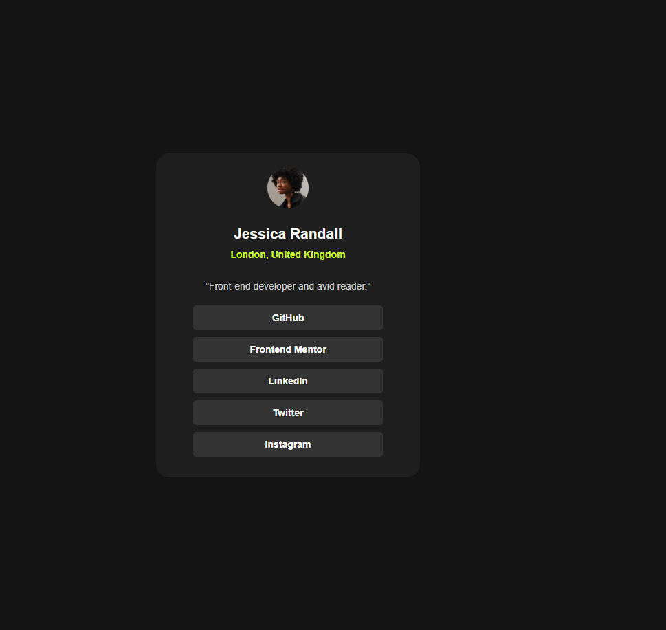
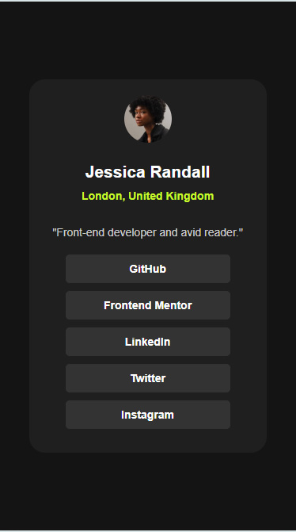

# Frontend Mentor - Social links profile solution

This is a solution to the [Social links profile challenge on Frontend Mentor](https://www.frontendmentor.io/challenges/social-links-profile-UG32l9m6dQ). Frontend Mentor challenges help you improve your coding skills by building realistic projects.

## Table of contents

- [Overview](#overview)
  - [The challenge](#the-challenge)
  - [Screenshot](#screenshot)
- [My process](#my-process)
  - [Built with](#built-with)
  - [Continued development](#continued-development)
- [Author](#author)

**Note: Delete this note and update the table of contents based on what sections you keep.**

## Overview

### The challenge

Users should be able to:

- See hover and focus states for all interactive elements on the page

### Screenshot




## My process

### Built with

- HTML5 markup
- CSS
- Flexbox

### What I learned

Use this section to recap over some of your major learnings while working through this project. Writing these out and providing code samples of areas you want to highlight is a great way to reinforce your own knowledge.

To see how you can add code snippets, see below:

```html
<main class="profile-links">
  <div class="profile-links-container">
    
    <h2 class="username">Jessica Randall</h2>
    <p class="location">London, United Kingdom</p>
    <p class="description">"Front-end developer and avid reader."</p>
    <div class="links-container">
      <a href="#"><div>GitHub</div></a>
      <a href="#"><div>Frontend Mentor</div></a>
      <a href="#"><div>LinkedIn</div></a>
      <a href="#"><div>Twitter</div></a>
      <a href="#"><div>Instagram</div></a>
    </div>
  </div>
</main>
```

```css
.links-container a {
  text-align: center;
  margin-bottom: 10px;
  padding: 10px;
  background-color: hsl(0, 0%, 20%);
  font-weight: 600;
  border-radius: 5px;
}

.links-container a:hover {
  background-color: hsl(75, 94%, 57%);
  color: hsl(0, 0%, 20%);
  transition: 0.3s;
}
```

### Continued development

Practice more on css flexbox to build layouts.

## Author

- Frontend Mentor - [@usman-97](https://www.frontendmentor.io/profile/usman-97)
